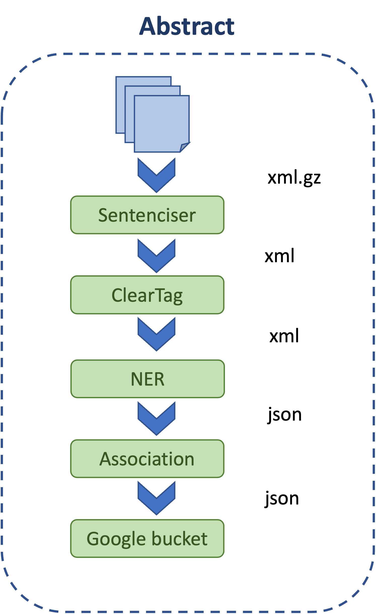
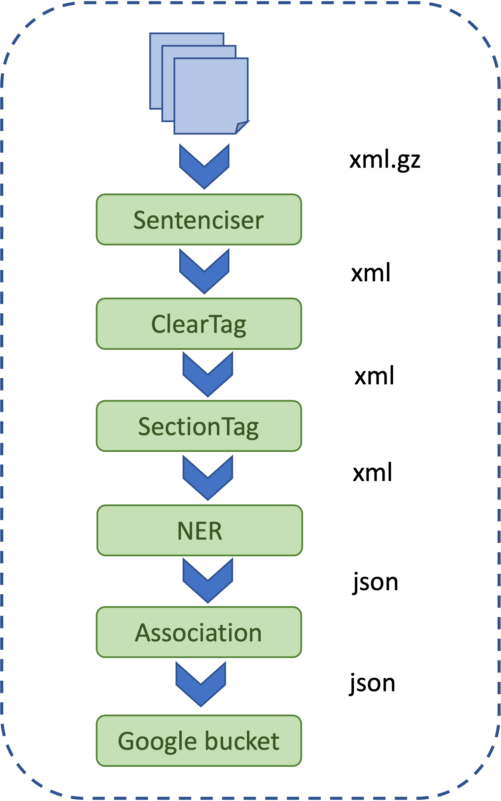

# OpenTargets Entity Recognition Pipeline 
This repository contains the core components of the Open Targets Europe PMC entity recognition and association pipeline, used to annotate biomedical entities and their relationships within scientific literature.

## Table of Contents
- [Project Overview](#Overview)
- [Sentence Boundary Identification](#sentence-boundary)
- [Cleaning Formatting and Tags](#cleaning-formatting-and-tags)
- [Identifying Sections in Full-Text Articles](#identifying-sections-from-full-text-articles)
- [NER Identification](#ner-identification)
- [Target-Disease Association Classification](#target-disease-association-classification)
- [Training the Association Model](#training-the-association-model)
- [Running the Pipeline](#running-the-pipeline)
- [Pipeline Diagrams](#pipeline-diagrams)


### Overview
As part of the Open Targets literature mining project, Europe PMC team currently annotates Medline abtracts, pre-prints abstract from a number of sources and full-text articles from PubMed Central with BioMedical Entities and provides Entity association for the Open Targets platform. 
Europe PMC team mines the following target entities using BioBERT model: 
- Gene/Proteins 
- Diseases
- Chemicals
- and Organisms. 

Entity Association: Evidence sentence/string is defined by the co-occurence of different Entity types in a sentence. For example, "Telethonin/T-CAP has taken on added importance due to its causal role in limb-girdle muscular dystrophy type 2G (Moreira et al., 2000)." is an evidence sentence describing association between Target (Gene/Proteins) "T-CAP" and Disease "limb-girdle muscular dystrophy type 2G". This repository describes the core Named Entity Recognition (NER) and Target-Disease association classification.
<br>
### Sentence boundary

The first component of the Open Targets Association identification is the `Sentenciser`. We need to identify the sentence boundaries as our entity association is sentence-based. The Sentenciser (Sentenciser.py) takes GZip XML file containing multiple abstracts and full-text articles as input and produces XML file with sentence boundaries marked by SENT tags. Abstracts and the Full-text have different file formats, please check the examples folder of the repo for the examples. This scripts take three command-line arguments, 
- -f : Input file path [GZIP XML file] 
- -o : Full path for the output XML file. Note that this argument is simply passed as the name of the output file with the sentence boundaries marked. 
- -d : The input file type i.e. whether it's an abstract or full-text file (`a` for abstracts, `f` for full-text) 
See usage below:
syntax:
```
python Sentenciser.py -f <path/to/input_file.gz> -o </path/to/output_file_name.xml> -d <file_type>
```
Example usage:
```

python Sentenciser.py -f <path/to/input_file.gz> -o </target_save_path/to/output_file.xml> -d f

```
### Cleaning formatting and other tags

The next step in the pipeline is to remove any XML tags appearing with the SENT tag and improve accuracy of NER. This script (CleanTags.py) takes the output of the Sentenciser as input using the -f argument and saves the output file mentioned after the -o option in `.xml` format.
Example usage:
```
python CleanTags.py -f <path/to/output_file_from_sentenciser.xml> -o </target_save_path/to/output_file.xml> -d f
```


### Identifying Sections from the Full-text articles

This part of the pipeline is only applicable to fulltext articles. The script (OTAR_new_pipeline_section_tagger.py) identifies sections within full-text articles (e.g., Introduction, Results, Conclusion, etc). The aim is to assist the Open Targets platform in ranking the importance of evidence strings present within the article.

This script takes two command line argumnets

- -f : Input XML file path which is output of the CleanTags.py script
- -o : Output XML file path

Example usage:
```

python OTAR_new_pipeline_section_tagger.py -f <path/to/output_file_from_cleantags> -o </target_save_path/to/output_file.xml>

```

### NER identification

Europe PMC team developed a developed a gold standard dataset of 300 full-text articles for three BioMedical Entities, namely Gene/Proteins, Diseases, and Organisms. BioBERT language model was fine tuned for the NER task using this dataset. Later, using publicly available dataset Chemicals, a NER model was generated and used to annotate the 300 full-text articles with Chemicals. Europe PMC team used this annotation to generate the model to annotate all four Entities for the Open Targets platform and identify association between Targets (Gene/Proteins), Diseases and Chemicals. Our NER tagger (OTAR_new_pipeline_cluster_all.py) currently annotates the Entities mentioned earlier and finds the evidence strings to report them in JSON format. The output file is a multiline JSON file where each line represents a JSON object for an article. This script takes five command-line arguments,

- -f : the full path for the input file [i.e. the output of the section tagger (OTAR_new_pipeline_section_tagger.py) for the full-text or the output of the CleanTags.py for the abstracts]
- -o : Output Directory
- -m : NER model directory, (Current model can be obtained from here: https://github.com/ML4LitS/annotation_models)
- -l : TSV file path containing mapping between PMIDs and PMCIDs and their publication dates. Please refer to the examples folder for an example of this file.
- -d : Input file type (a for abstracts, f for full-text)

### Target-Disease association classification

The component of this pipeline classify Target-Disease evidence strings using a BioBERT model. The manual curators annotated about 1K evidence strings from the gold-standard dataset. The annotators tagged the evidence strings using three tags.

- YGD : When the evidence string describe an association between the target and the disease mentioned in the sentence. Association can be positive or negetive.
- NGD : When the evidence string does not describe an association between the target and the disease mentioned in the sentence.
- AMB : When there is not enough information available in the sentence to identify the association.
We fine-tuned BioBERT model using SimpleTransformer package and classify only the Target-Disease association sentences as part of this pipeline due to the available dataset. Our association annotation script (otar_association_annotation.py) takes three arguments.

- -f : Input JSON file path, i.e. the output of the NER code [OTAR_new_pipeline_cluster_all.py].
- -o : Output JSON file path.
- -m : Association model directory, for this repo 'association_model' folder.

## Training association model
Please checkout the association folder for the code used to train and test the association classifier.

<br>
Please refer to https://gitlab.ebi.ac.uk/saha/opentargetsorchestrator see how Europe PMC team run this pipeline daily in an automated manner.

## Abstract Pipeline
<br>

<br>

## Full-text Pipeline


